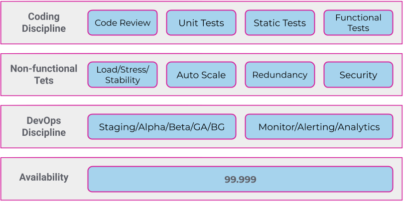

# Quality and Velocity: Our Seven Year Journey to High Availability 

In the face of a highly dynamic software ecosystem, the world of quality assurance has remained stagnant. As software products grow in complexity, quality assurance is left facing a dilemma: the demand for rapid delivery is at war with the need to ensure thoroughly-tested products.

How can QA teams take a stronger approach to quality testing without compromising on speed and product growth? 

At the Vonage R&D site, the 50 person SDET team (software developer in test) has a solution. We call it **Qualocity**: the layered testing approach that addresses both quality and velocity.

## So where did it start? 

Most companies focus testing efforts on two main areas: functional tests, which emulate the basic use of an application, and non-functional system load. QA groups would commonly measure product quality by requirement coverage, and by the number of bugs found, escaped, reopened - essentially glorifying the bugs instead of preventing them in the first place.

But the world has changed. Not only are we facing an increase of fragmentation in things like operating systems, devices, and latency, but we are far into the era of the apps, an era that is dynamic and highly competitive. We’re seeing APIs and common libraries that are now enabling faster development, as well as various cloud services that provide the developer with an environment that doesn’t rely on operating systems, security, or even scaling. 
All this to say, companies with month-long waterfall release cycles can no longer compete with the demand for features and innovation.  
Companies that can’t deliver fast will be late to market. 

## The Layers 

And yet, despite the need for speed, there is no point in rushing to production with only a few methods of outdated quality tests under our belt. Because if we keep doing things the way we have been for years, we’ll end up chasing our tails in a circle of quality issues and escalations, which isn’t fun for anyone.  Leaving us with these two critical factors: on the one hand, quality must improve. But we need the ability to consistently and consciously commit changes to production knowing we’ve done everything we can. 

Seven years ago, we began to research additional methods to add to the two original layers, functional and load testing. During that time, we have steadily built up the quality and velocity approach that led us to 99.999% system availability, known colloquially as the “five nines.” 

Through research and experimentation, we created the process presented here, which is made up of three multi dimensional layers: 

## Coding discipline

It might seem obvious that proper code discipline is at the core of software quality. Testing begins here, in consistently following standards and procedures. 

- **Code reviews** should be conducted by peers, every time, and automated code should be treated in the same way. 

- **Unit tests** with wide coverage allow us to easily test with confidence we haven't broken the codebase. 

- **Static analysis tools** discover static bugs and security vulnerabilities. There are plenty of these on the market that offer different specifications for different needs.

- **Functional tests** should focus on mocking. Test at the API level and surround your automation with mocks that test exactly what you asked for. Avoid end-to-end automated tests because you are testing your code and not the end-to-end product. As a result, coverage will increase, tests become more stable.

Ensure that functional tests run _everywhere_, not only in development and QA environments,  but in production as well. If built correctly, they will stand as a great monitoring tool and they won’t fail often. We all know how frustrating it is to be alerted at 2am for a false alarm. 

## Non-Functional tests

For these, you’ll need to take a ride outside your comfort zone and think bigger. You’ll need to know the average use of your product and take it to its edge. 

Consider an API that you know receives 1000 calls per second on average, with a peak of 1200 at 10am and 3pm, and a low of 800 at 10pm. 

- For **Load Testing** you’ll want to make 1000 calls every second over a period of 24 hours. 
- In **Stress Tests** you’ll keep adding calls until you hit a failure. That’s your stress point. Decide what to do about it and try again. 
- **Stability Tests** account for average usage over time. For an extended period of time, make 1200 calls per second at peak hours, 800 at low hours, and 1000 the rest of the time. This will ensure that you can stay stable under your average load. 

If your software includes capabilities for **auto scaling**, ensure testing on additional instances once the limit is reached. 
Test **redundancy** for regions and zones because remember, your cloud services will fail from time to time.
**Security** in this context refers to application penetration testing, OSS testing (external libraries and APIs), and static analysis tools. Code reviews are crucial in this stage, and should be part of the software development life cycle. 

## DevOps Discipline 

Let it _soak_. Don’t fool yourself into believing that you’ve protected yourself from all edge cases once everything mentioned above works well. You just can’t. You’ve got more devices, more account features, and more configurations to consider. Take the time to ensure that tests are actually accurate. 

### Remember to be gradual with releases

- Encourage **bug squashing** by the development team before going to staging   

- Then try it on the **alpha** (internal) users before sharing with the *beta* (external) users. Those beta groups should represent small segments of your production base, in regards to instances and devices. 

- Once the version is widely available, enable a **blue-green** deployment system, which alternates production and staging servers, and allows you to quickly fall back to a previous version if necessary. 

- Monitor scrupulously; set up alerting and analyze the test data

- Talk with your customer success teams and explore other sources of feedback, like on app stores, social media or community platforms. 

If you’ve followed all these steps, we can pretty much guarantee that you’re now ready for GA.

## In Conclusion 

What we presented above is an approach for a quality strategy that we feel is close to perfect, yet still attainable. While we haven’t implemented it fully for all of our services, specifically legacy code and inherited software, we can say with confidence that each layer has proven to make a significant difference. The huge team of SDETs and DevOps engineers at Vonage will vouch for that. It is a huge undertaking, but we encourage you to add one layer at a time, and hope that each layer brings you closer to your desired availability. 
